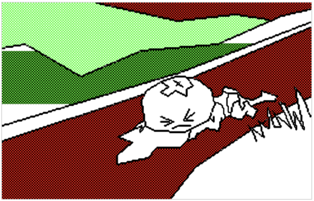
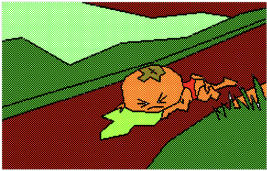

# pc88canvas

## NEC PC8801風 JS Canvas 作画プログラム

パソコン黎明期（？） NEC PC8801 のアドベンチャーゲーム作画処理を JavaScript で再現。

[作画開始（data.txt）](https://bakuretuken.github.io/pc88canvas/)

[作画開始（data2.txt）](https://bakuretuken.github.io/pc88canvas/index2.html)

[作画開始（data10.txt）](https://bakuretuken.github.io/pc88canvas/index10.html)

### index.html（data1.txt）


　↓


### index10.html（data10.txt）


　↓


## フォーマット

1行1線（黒色）
```
314,244 314,245 313,246 312,246 312,247 311,248 310,248 309,248 308,248 308,249 307,250 306,250 306,251 305,252 304,252 303,252 302,252 302,253 301,254
```

線頭に色番号があるとその色で線作画（黄色で線作画）
```
6 314,244 314,245 313,246 312,246 312,247 311,248 310,248
```

行頭に P があると塗りつぶし
中間色対応
```
P 301,8 1
P 301,8 0 2
```

P X,Y 色番号
P X,Y 色番号1 色番号2

**色番号**
0:黒 1:青 2:赤 3:紫 4:緑 5:水色 6:黄 7:白

**License**
This Program is licensed under the MIT License.
**Note**: Sample images used include copyrighted materials.
